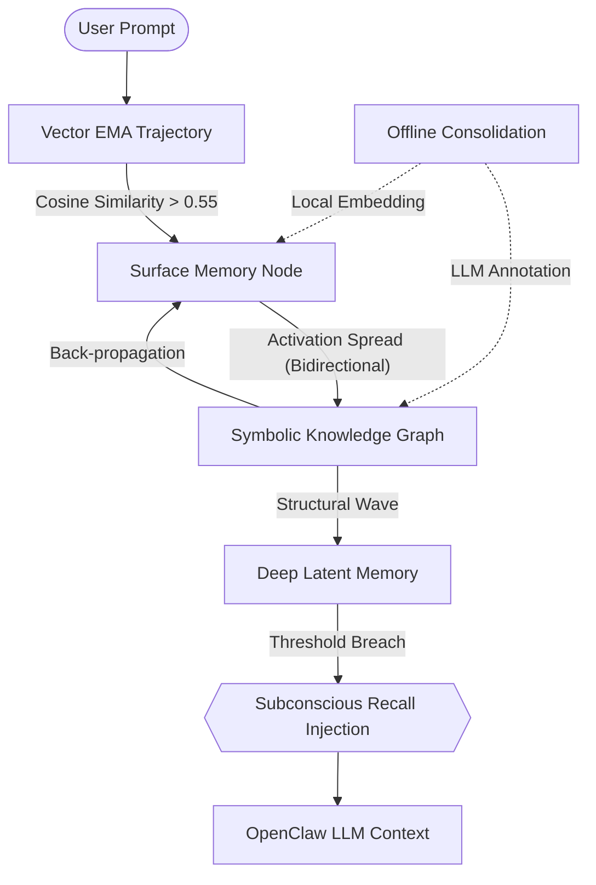

# 🧠 memory-enhanced | V8 Neuro-Symbolic Memory System

[](https://github.com/pongs1/memory-enhanced/blob/main/LICENSE)
[](https://github.com/openclaw/openclaw)
[](#)

[**English**](./README.md) | [**中文简体**](./README_zh.md)

`memory-enhanced` is a state-of-the-art cognitive memory architecture for OpenClaw agents. It transforms your AI from a stateless chatbot into a personified agent capable of **episodic recording**, **semantic distillation**, and **subconscious associative recall**.

Built upon cognitive science principles, V8 merges continuous vector thought trajectories with discrete logical graphs to solve the "lost in context" and "catastrophic forgetting" problems in LLM agents.

---

## ✨ Key Features

- **🚀 System 1: Real-time Associative Recall**: Sub-millisecond "subconscious" memory injection using local ONNX embeddings (Xenova) and Spreading Activation.
- **🧠 System 2: Deep Semantic Routing**: Offline LLM-driven graph annotation to discover latent causality and metaphorical links.
- **📉 Exponential Decay & Pruning**: Mimics the Ebbinghaus Forgetting Curve. Non-essential memories gracefully fade or archive.
- **🛡️ Cognitive Pressure Regulation**: Prevents task "tunnel vision" by forcing checkpoints and status updates during long tool chains.
- **⚡ Zero-Token Lifecycle Hooks**: Intercepts the generative stream natively via OpenClaw hooks—saving thousands of tokens compared to SKILL-based instructions.
- **⚖️ Hub Penalization & RLHF**: Prevents "activation storms" by penalizing high-degree nodes and allows dynamic user feedback to prune graph edges.

---

## 🏗️ Architecture: The Neuro-Symbolic Wave



### The Dual-Intelligence Core
1.  **Continuous Tracking (Xenova)**: We track the "momentum" of the LLM's thought process ($V_{query} = 0.7 * V_{curr} + 0.3 * V_{prev}$).
2.  **Discrete Mapping (Symbolic Graph)**: Logical edges pre-computed by a "thinking" model (e.g., DeepSeek R1) define the axons.

---

## 🚦 Quick Start

### 1. Installation
```bash
git clone https://github.com/pongs1/memory-enhanced.git ~/openclaw/extensions/memory-enhanced
cd ~/openclaw/extensions/memory-enhanced
pnpm install
openclaw plugins install -l .
```

### 2. Configure `openclaw.json`
Add the plugin path and enable the hooks:
```json
{
  "plugins": {
    "load": { "paths": ["/absolute/path/to/memory-enhanced"] }
  },
  "agents": {
    "defaults": {
      "bootstrapExtraFiles": [".memory/active/scratchpad.md", "memory/"]
    }
  }
}
```

### 3. Requirements
- **Local Mode**: Uses `@xenova/transformers` (auto-downloaded on first run).
- **Offline Mode**: Set `OPENAI_API_KEY` for System 2 semantic wiring.

---

## 🛠️ Tool Suite

| Tool | Purpose | Cognitive Role |
|---|---|---|
| `memory_record` | Logs important decisions/facts | Episodic Encoding |
| `memory_working` | Manages focus stack (max 7 items) | Working Memory |
| `memory_consolidate` | Triggers decay, archiving, and graph wiring | Consolidation |
| `memory_explore` | Manual graph traversal | Deep Retrieval |

---

## 📜 Principles of Operation

- **Sparse Symbolic Layer**: Unlike dense LLM weights, the knowledge graph is discrete and interpretable. You can manually prune or boost edges.
- **Hebbian Learning**: Memories that are frequently recalled are reinforced (decay reset), while unused facts slide into the archive.
- **Neuro-Consistency**: Uses O(E) degree-based dampening to ensure activation energy flows naturally without exploding into chaos.

---

## 🤝 Contributing

We welcome contributions to the cognitive engine! Please see `CONTRIBUTING.md` for our coding standards and internal ADaPT protocols.

---

## 📄 License & Credits

MIT License. Inspired by the Hippocampus-Cortex transfer theory and the ADaPT task management framework.
