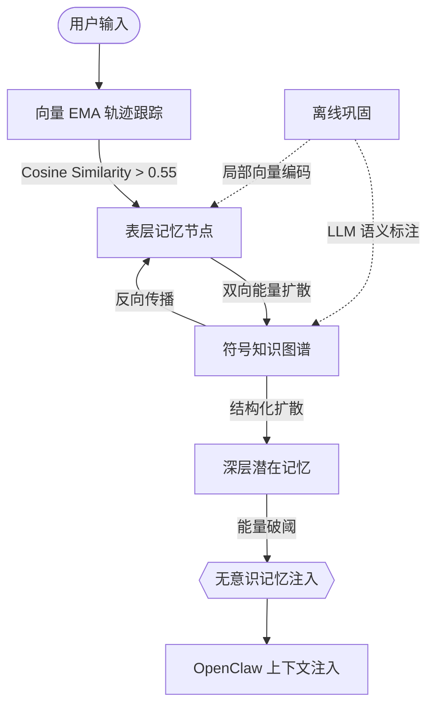

# 🧠 memory-enhanced | V8 神经常驻+符号逻辑记忆系统

[](https://github.com/pongs1/memory-enhanced/blob/main/LICENSE)
[](https://github.com/openclaw/openclaw)
[](#)

[**English**](./README.md) | [**中文简体**](./README_zh.md)

`memory-enhanced` 是为 OpenClaw Agent 设计的高性能、脑启发式记忆架构。它将您的 AI 从一个“无状态”的聊天机器人转变为拥有**情节记录**、**语义提炼**和**无意识联想唤醒**能力的拟人化 Agent。

V8 版本融合了连续向量思维轨迹（System 1）与离线符号逻辑图（System 2），旨在解决 LLM Agent 在长上下文中的“注意力流失”与“灾难性遗忘”问题。

---

## ✨ 核心特性

- **🚀 System 1: 实时联想唤醒**: 毫秒级的“潜意识”记忆注入。使用局部 ONNX 嵌入模型（Xenova）与能量扩散算法（Spreading Activation）。
- **🧠 System 2: 深度语义路由**: 离线状态下由 LLM 驱动的图谱自动标注，挖掘潜在的因果逻辑与隐喻跨度。
- **📉 指数级衰减与裁减**: 模拟艾宾浩斯遗忘曲线。非核心记忆会随着时间自然淡出或归档。
- **🛡️ 认知压力调节**: 防止任务“隧道视野”。在长工具链执行中通过 Cognitive Pulse 强制 Agent 进行保存点记录与状态更新。
- **⚡ 零 Token 生命周期钩子**: 原生注入 OpenClaw 生成流——相比传统的 SKILL.md 指令，单回合可节省数千 Token。
- **⚖️ 枢纽节点惩罚与 RLHF**: 通过计算度数（Degree）防止“激活风暴”，并支持根据用户反馈动态裁剪图边缘权重。

---

## 🏗️ 架构图：神经符号波



### 双智能内核
1.  **连续轨迹跟踪 (Xenova)**: 实时捕捉 LLM 的“思维动量” ($V_{query} = 0.7 * V_{curr} + 0.3 * V_{prev}$)。
2.  **离线离散映射 (Symbolic Graph)**: 由“思考模型” (如 DeepSeek R1) 预计算的逻辑神经网络边。

---

## 🚦 快速开始

### 1. 安装
```bash
git clone https://github.com/pongs1/memory-enhanced.git ~/openclaw/extensions/memory-enhanced
cd ~/openclaw/extensions/memory-enhanced
pnpm install
openclaw plugins install -l .
```

### 2. 配置 `openclaw.json`
确保插件路径正确并启用工作区映射：
```json
{
  "plugins": {
    "load": { "paths": ["/absolute/path/to/memory-enhanced"] }
  },
  "agents": {
    "defaults": {
      "bootstrapExtraFiles": [".memory/active/scratchpad.md", "memory/"]
    }
  }
}
```

### 3. 环境需求
- **实时模式**: 使用 `@xenova/transformers` (首次运行自动下载)。
- **离线模式**: 配置 `OPENAI_API_KEY` 以进行 System 2 语义建图。

---

## 🛠️ 工具箱

| 工具名 | 用途 | 认知角色 |
|---|---|---|
| `memory_record` | 记录关键决策与事实 | 情节编码 |
| `memory_working` | 管理任务焦点栈 (最高 7 项) | 工作记忆 |
| `memory_consolidate` | 触发衰减、归档与建图 | 记忆巩固 |
| `memory_explore` | 人工遍历记忆图谱 | 深度调取 |

---

## 📜 运行原则

- **稀疏符号层**: 与致密的权重不同，知识图谱是离散且可解释的。你可以手动增加或削减任意一条“联想边”。
- **赫布学习 (Hebbian Learning)**: 经常被唤醒的记忆会被强化（衰减重置），而未使用的知识会滑入归档。
- **神经一致性**: 使用基于度的分摊算法，确保激活能在图中自然流动，而不至于陷入死循环或爆炸。

---

## 📄 开源协议

MIT License. 受海马体-皮层转移理论与 ADaPT 任务框架启发开发。
